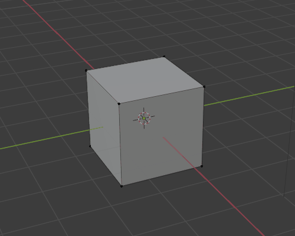

# Set Origin in Edit Mode Add-on

This add-on adds a `Set Origin to Selected` option to the right-click menu in Edit Mode.

### Motivation

The usual way to set the origin to selected vertices/edges/faces is this:

1. Select the vertex/vertices/edges/faces that you want to set the origin to in edit mode.
2. `Shift + S` to bring up the 3D cursor menu and select `Cursor to Selected`
3. `Tab` into Object Mode.
4. Right-click on the active object and select `Set Origin > Origin to 3D Cursor`

Now you have the origin where you want it, but you moved the 3D cursor and you are in Object Mode. Also, this is a quite complex series of steps to remember for something so trivial.

This add-on simplifies the process by adding a `Set Origin to Selected` option to the right-click menu in Edit Mode.

### Installation

1. Download [set_origin_in_edit_mode.py](set_origin_in_edit_mode.py)
1. Follow the [Blender Documentation instructions for installing add-ons](https://docs.blender.org/manual/en/latest/editors/preferences/addons.html#installing-add-ons) to install the `.py` file as an add-on

### Known Issues

- [Undoing `Set Origin to Selected` sometimes creates unnecessary undo history entries, and it's not always possible to redo the action.](https://github.com/ChrisCrossCrash/SetOriginInEditMode/issues/1)
